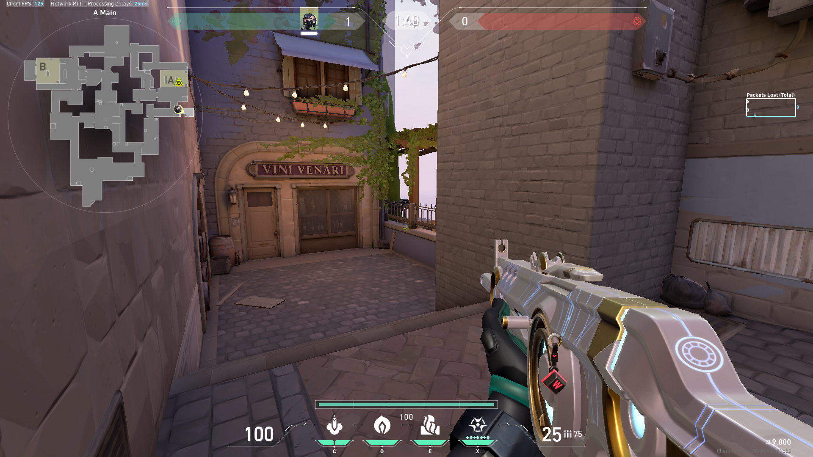
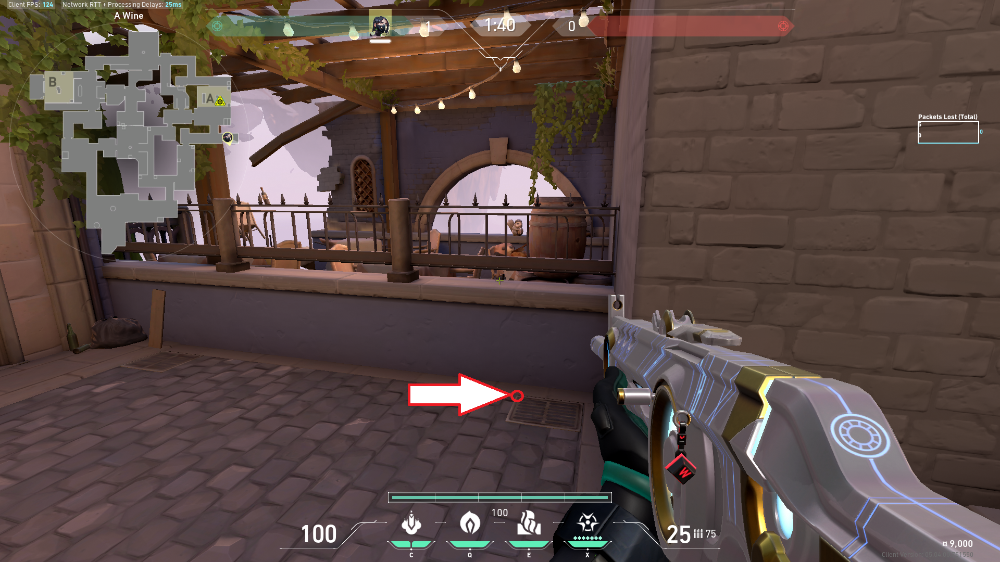
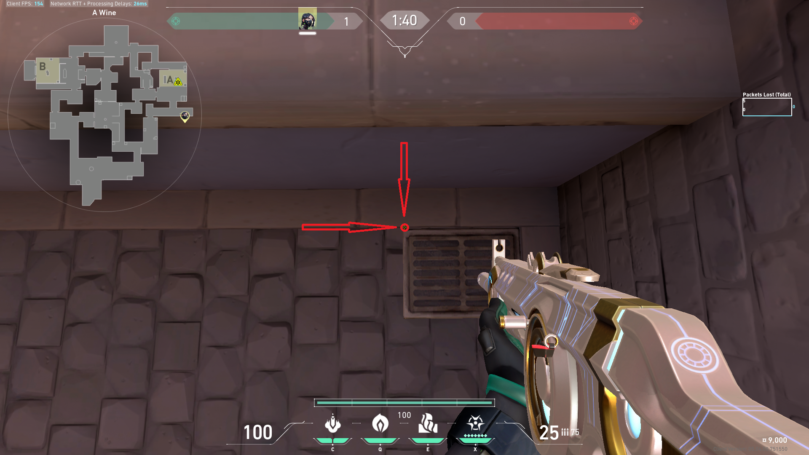
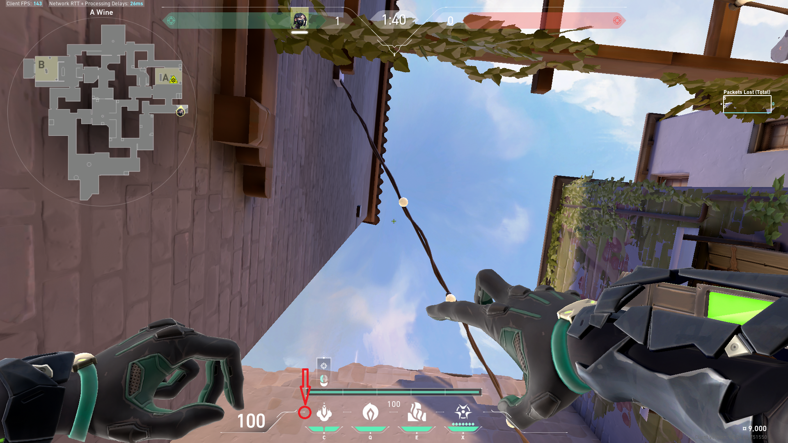
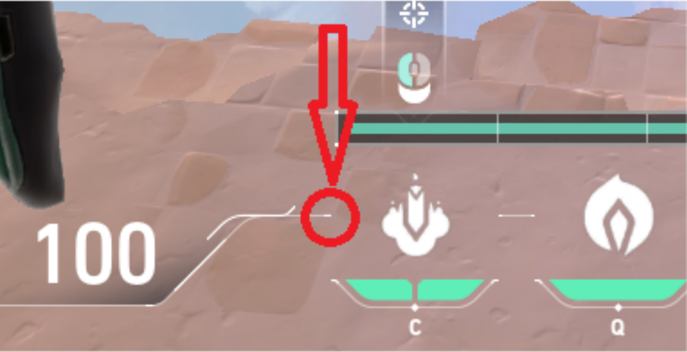
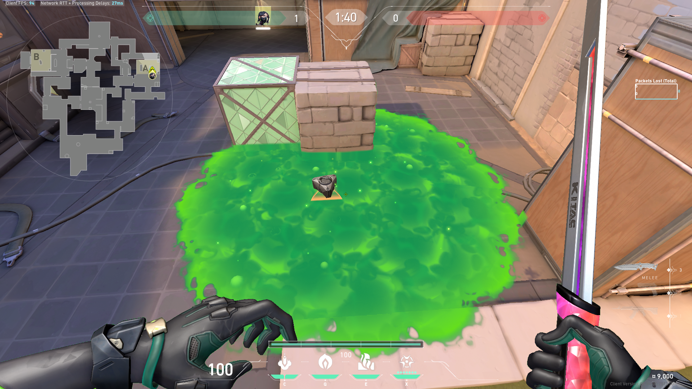

# Elo-Art
For valorant
  
 
Thanks for coming to review Elo-Art.
Unfortunately, There isn't a working prototype right now, But It would be great if I could get some feedback and direction on if this app will be approved in the future.
 
# user story for Elo-Art
 
The user plants the spike as usual 

  

The player then procceeds to play the game as usual, and moves into a defensive position

  

 
the player is then presented with information on how to execute a lineup, without having to take a single action.
This includes information on where to stand

  
  

as well as information on where to aim

  
  

and the expected results of their newly learned skill

  

Thanks so much for coming. Hope the rest of your day goes smoothly.
